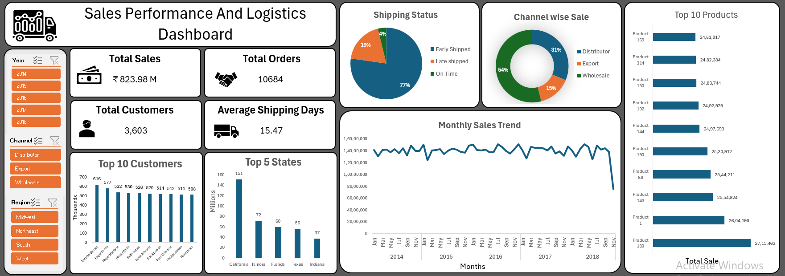

# Sales Performance and Logistics Dashboard (Excel)

An end-to-end Excel data analytics project using Power Query, Excel Data Model, PivotTables, and an interactive dashboard to analyze sales performance and logistics efficiency.

---

## 📖 Overview

This project focuses on analyzing sales and logistics data to help stakeholders understand business performance across time, regions, channels, customers, and products.  
The entire solution is built in **Microsoft Excel**, using **Power Query** for data preparation and the **Excel Data Model** for scalable and refresh-safe analysis.

---

## ❓ Problem Statement

Businesses often struggle to track sales performance and shipping efficiency across multiple dimensions.  
This project aims to answer:
- How are sales performing over time?
- Which sales channels contribute the most revenue?
- Are orders shipped on time?
- Which products, customers, and states drive revenue?
- How efficient is the logistics process?

---

## 📊 Dataset

The dataset consists of **6 Excel sheets**, forming a structured data model:

### 1️⃣ Sales Orders (Fact Table)
- Order Number
- Order Date, Ship Date, Due Date
- Customer Index
- Channel (Distributor, Export, Wholesale)
- Country Code
- Warehouse code
- Product Index
- Delivery Region Index
- Product Description Index
- Order Quantity
- Unit Price
- Line Total
- Total Unit Cost 

### 2️⃣ Customers
- Customer index
- Customer Names

### 3️⃣ Regions
- id 
- name
- country
- state_code
- state
- type
- latitude, longitude

### 4️⃣ State Regions
- State Code 
- State
- Region

### 5️⃣ Products
- Index
- Product Name
- Product Category

### 6️⃣ Multi Scenario
- Scenario

📌 All datasets are loaded using **Power Query** and connected through the **Excel Data Model**.

---

## 🛠 Tools & Technologies

- Microsoft Excel
- Power Query
- Excel Data Model (Power Pivot)
- PivotTables \& PivotCharts
- Excel Slicers
- Interactive Excel Dashboard

---

## ⚙️ Methods
### Data Cleaning \& Transformation
- Standardized data types
- Renamed and reordered columns
- Created calculated fields (Shipping Days)
- Added conditional columns (Early, On-Time, Late Shipment)
- Removed unnecessary columns
- Used connection-only queries

### Data Modeling

- Fact–dimension modeling using the Excel Data Model
- Relationships between Sales Orders, Customers, Products, and Regions
- Queries loaded as **Only Create Connection + Data Model**


### Exploratory Data Analysis (EDA)

- Monthly sales trends
- Channel-wise sales comparison
- Shipping performance evaluation
- Top products, customers, and states analysis

---

## 🔍 Key Insights

- Identified sales trends across multiple years
- Determined average shipping duration and delivery efficiency
- Highlighted delayed vs on-time shipments
- Identified top-performing products and customers
- Compared sales performance across channels and regions

---

## 📈 Dashboard

### Sales Performance and Logistics Dashboard
The dashboard includes:
- **KPIs**: Total Sales, Total Orders, Total Customers, Average Shipping Days
- **Shipping Status**: Early, On-Time, Late
- **Channel-wise Sales Distribution**
- **Monthly Sales Trend**
- **Top 10 Products**
- **Top 10 Customers**
- **Top 5 States**
- Interactive slicers for:
  - Year
  - Channel
  - Region
   
### Dashboard Preview  

 

---

## 📂 Folder Structure

```text
├── data/
│ └── Sales\_Data.xlsx       # Contains 6 dataset sheets
│
├── dashboard/
│ └── Dashboard.xlsx        # Power Query, Data Model \& Dashboard
│
├── .gitignore
└── README.md               # Project documentation
```  

---

## ▶️ How to Run This Project

1. Clone or download the repository
2. Keep the folder structure unchanged
3. Open `Dashboard.xlsx`
4. Click **Refresh All**
5. Use slicers to explore insights interactively

---

## ✅ Results & Conclusion  

- Implemented multi-table data modeling using Excel Data Model
- Delivered an interactive dashboard for business decision-making
- Demonstrated strong Excel, Power Query, and analytical skills

---

## 🔮 Future Work

- Add revenue and profit margin analysis
- Implement customer segmentation
- Automate data refresh workflows
- Extend analysis using Power BI or SQL
- Add sales and delivery forecasting

---

## 👤 Author & Contact

**Rohan Verma**  
* 📧 Email: vermarohan92571@gmail.com  
* 🔗 [LinkedIn](https://www.linkedin.com/in/rohan-verma-2011291ab/)

---


